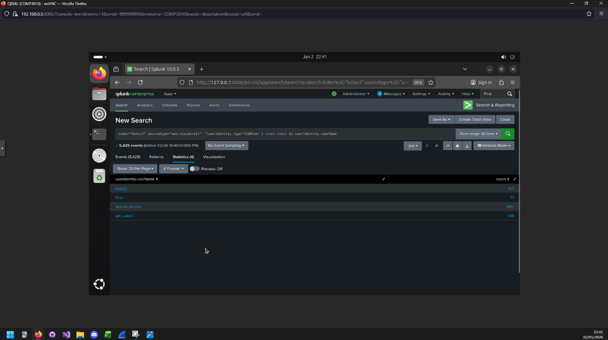
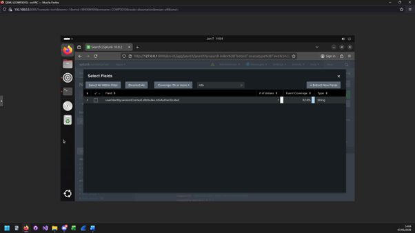
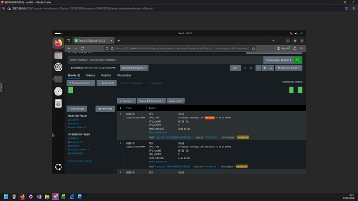
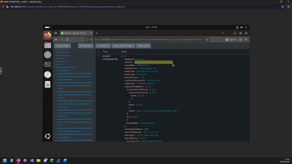
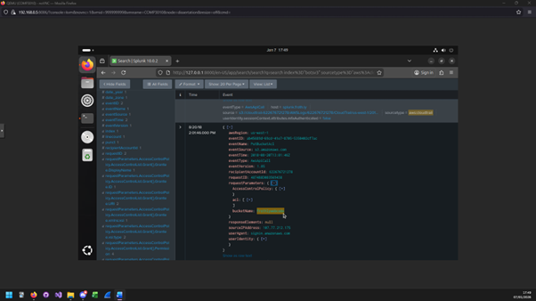
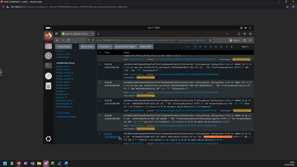
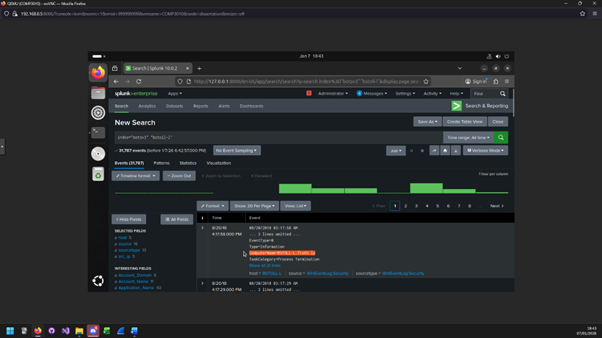

# BOTSv3 SOC Report

## Contents

- [Introduction](#introduction)
- [Installation & Data Preparation](#installation--data-preparation)
- [SOC Roles](#soc-roles)
- [BOTSv3 Analysis](#botsv3-analysis)
  - [200](#200)
  - [201](#201)
  - [202](#202)
  - [203](#203)
  - [204](#204)
  - [205](#205)
  - [215](#215)
- [Conclusion](#conclusion)
- [Appendix](#appendix)

---

## Introduction

This investigation is taken from the perspective of a Security Operations Centre (SOC) which is responsible for monitoring, detecting, and responding to threats across an organisations network architecture. It is an essential form of security revolved around visibility, leveraging assets and processes which aims to identify malicious activity, assess risk, and manage incident response in line with an organisation’s security objectives.

The report is structured around the **Boss of the SOC v3 (BOTSv3)** dataset, with references to the BOTSv3 questions to evaluate the simulated attack and provide possible solutions against further attempts.

### Objectives

- Assess the effectiveness of Splunk's SIEM capability against a simulated attack.
- Understand and map the attack using the BOTSv3 questions as a roadmap alongside the Cyber Kill Chain (CKC) methodology\[1\].
- Reflect on SOC processes, escalation paths, and strategic incident handling.

### Assumptions

- A single attack campaign is taking place.
- All logs are complete and untampered.
- Situational evidence may be used beyond direct BOTSv3 context clues.

---

## Installation & Data Preparation

A small form factor (SFF) system with a multi-core CPU, NVMe storage, and sufficient RAM was used to support sustained indexing and search workloads. Proxmox VE was selected to host the Splunk instance as an isolated SOC analysis environment, enabling snapshot-based recovery and reproducibility.

Splunk was deployed on an Ubuntu Desktop VM to reduce overhead compared to Windows while still allowing efficient analyst interaction through a web-based interface. Ubuntu was cross-referenced with official Splunk compatibility documentation.

Splunk Enterprise **10.0.2** was selected to align with modern SOC workflows. A standalone deployment was used, as distributed components would add unnecessary complexity. Add-ons were intentionally limited to preserve analytical clarity and derive evidence directly from raw SPL queries.

---

## SOC Roles

Throughout the BOTSv3 analysis, I will make references to SOC roles, and their processes/escalation procedures\[2\], \[3\]. The following is a breakdown of the main roles involved:

### Tier 1 SOC Analyst

- Continuous log and alert monitoring
- Triage alerts and identify false positives
- Document events in ticketing systems
- Escalate verified threats to Tier 2

### Tier 2 SOC Analyst

- Deep investigation of escalated events
- Scope determination and threat intelligence analysis
- Lead containment and recovery efforts
- Escalate high-impact incidents to Tier 3

### Tier 3 SOC Analyst

- Handle major incidents
- Perform or oversee vulnerability assessments and penetration testing
- Recommend security tooling and monitoring improvements

---

## BOTSv3 Analysis

### Q1

**List out the IAM users that accessed an AWS service (successfully or unsuccessfully) in Frothly’s AWS environment**

```spl
index="botsv3" sourcetype="*aws*" *iam*
```

```spl
index="botsv3" sourcetype="aws:cloudtrail" *iam*
```

```spl
index="botsv3" sourcetype="aws:cloudtrail"
| stats count BY userIdentity.type
```

```spl
index="botsv3" sourcetype="aws:cloudtrail" userIdentity.type="IAMUser"
| stats count BY userIdentity.userName
```


Identified IAM users:
- bstoll
- btun
- splunk_access
- web_admin

---

### Q2

**What field would you use to alert that AWS API activity has occurred without MFA (Multi-Factor Authentication)?**

```spl
index="botsv3" sourcetype="aws:cloudtrail"
```

```spl
index="botsv3" sourcetype="aws:cloudtrail"
| stats count BY eventType
```

```spl
index="botsv3" sourcetype="aws:cloudtrail" eventType="AwsApiCall"
```



Field used:
userIdentity.sessionContext.attributes.mfaAuthenticated


---

### Q3

**What is the processor number used on the web servers?**

```spl
index="botsv3" *amd* OR *intel*
| stats count BY sourcetype
```

```spl
index="botsv3" sourcetype="hardware"
```


CPU Type: 
E5-2676

---

### Q4

**Bud Accidentally makes an S3 bucket publicly accessible. What is the event ID of the API call that enabled public access?**

```spl
index="botsv3" *bucket* 
| stats count BY sourcetype
```

```spl
index="botsv3" sourcetype="aws:cloudtrail" 
| stats count BY eventName
```

```spl
index="botsv3" sourcetype="aws:cloudtrail" eventName="PutBucketAcl"
```


Event ID:
Ab45689d-69cd-41e7-8705-5350402cf7ac

---

### Q5

**What is Bud's username?**

From Q1, there were 2 users bstoll and btun, using the query

```spl
Index=“botsv3” bstoll
```
Yielded an smtp event containing a "receiver" field with both of their full names in:


Bud Stoll's username:
bstoll

---

### Q6

**What is the name of the S3 bucket that was made publicly accessible?**

```spl
index="botsv3" sourcetype="aws:cloudtrail" eventName="PutBucketAcl"
```
Using the same query from Q4, we can see a subfield in "requestParameters" called bucketName:


Bucket name:
frothleywebcode

---

### Q7

**What is the name of the text file that was successfully uploaded into the S3 bucket while it was publicly accessible?**

```spl
index="botsv3" sourcetype="*aws*” *bucket* 
| stats count BY sourcetype
```

```spl
Index=”botsv3” sourcetype=“aws:s3:accesslogs”
| reverse
```
After searching through the logs starting from the exact timestamp of the moment the bucket was made public, at 14:02:44PM, a PUT API request was made with the file name “OPEN_BUCKET_PLEASE_FIX.txt”



File name:
OPEN_BUCKET_PLEASE_FIX.txt

---

### Q8

**What is the FQDN of the endpoint that is running a different Windows operating system edition than the others?**

```spl
index="botsv3" *window*
```

```spl
index=”botsv3” sourcetype=“WinHostMon”
```

```spl
index=”botsv3” sourcetype=“WinHostMon” source=”operatingsystem”
```

```spl
Index=”botsv3” sourcetype=”WinHostMon” source=”operatingsystem”
| stats count BY host OS
```

```spl
index=“botsv3” “bstoll-l”
```
The first result of the final query identified the FQDN within the "ComputerName"



FQDN:
BSTOLL-L.froth.ly

---

## Conclusion

Through this analysis of the BOTSv3 dataset, there is a collection of evidence that highlights several critical security weaknesses across both defensive and reactive controls.  A key finding was the approximately 56-minute delay in remediating the publicly exposed S3 bucket, which indicates flaws in Frothly’s reactive security posture. 

In a compliant, live SOC environment, an incident of this severity would be expected to trigger near-immediate alerting and response mechanisms, reducing the exposure window significantly, possibly preventing the upload of a .txt file from an unauthorised user which occurred approximately 2 minutes later.

However, the ability to collect and analyse a high level of enriched data following the incident demonstrates a degree of maturity in Frothly’s incident response and logging capabilities. These findings can be leveraged proactively to inform targeted vulnerability assessments and strengthen security controls moving forward. 

Specific improvements should focus on enhancing real-time alerting, reducing response times, stricter access controls, and the enforcement of MFA. By addressing these areas Frothly can improve its overall resilience and reduce the likelihood and impact of similar incidents in the future.


---

## Appendix

\[1\]	‘Cyber Kill Chain®’, Lockheed Martin. [Online]. Available: https://www.lockheedmartin.com/en-us/capabilities/cyber/cyber-kill-chain.html

\[2\]	‘Security Operations Center (SOC) Roles and Responsibilities’, Palo Alto Networks. \[Online\]. Available: https://www.paloaltonetworks.com/cyberpedia/soc-roles-and-responsibilities

\[3\]	C. Kidd, ‘What Is a SOC? Security Operations Centers: A Complete Overview’, Splunk. \[Online\]. Available: https://www.splunk.com/en_us/blog/learn/soc-security-operation-center.html

