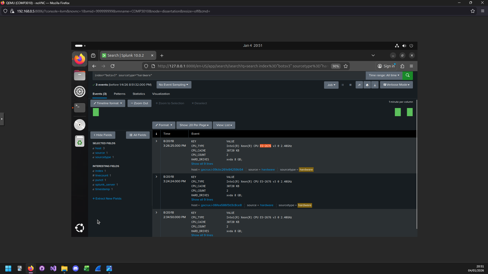
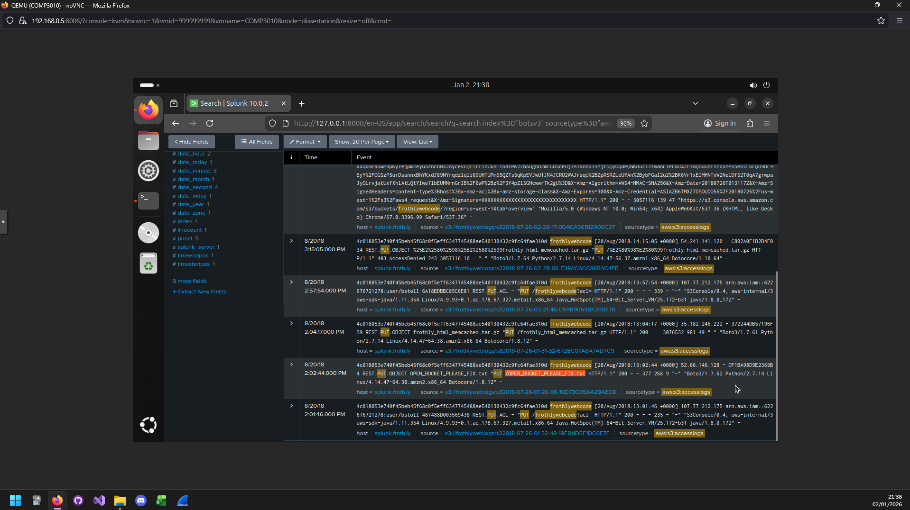
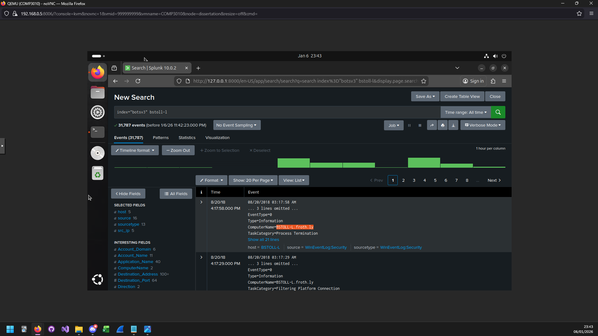

# COMP3010 BOTSv3 Analysis


Note: The "Research" field is a separate investigation into the SPL of Splunk and some interesting data (which are out of the scope of this report)


Video Presentation: ()


#### Introduction


This investigation is taken from the perspective of a Security Operations Centre (SOC) which is responsible for monitoring, detecting, and responding to threats across an organisations network architecture. It is an essential form of security revolved around visibility, leveraging assets and processes which aims to identify malicious activity, assess risk, and manage incident response inline with an organisations security objectives.

The report is structured around the "Boss of the SOC v3" BOTSv3 dataset, with references to the BOTSv3 questions to evaluate the simulated attack and provide possible solutions against further attempts.


The primary objectives are as follows:

* Assess the effectiveness of Splunk's SIEM capability against a simulated attack
* Understand and map the attack using the BOTSv3 questions as a roadmap alongside the Cyber Kill Chain (CKC) methodology
* Reflect on SOC processes, escalation paths, and strategic incident handling, comparing available toolsets and providing recommended improvements for the SOC


Assumptions:

* There is a single attack campaign taking place, and that all evidence found is directly attributable to this campaign
* Analysis of logs occurs post-incident, all logs are complete, and have not been tampered with or altered.
* Where applicable, situational evidence may be incorporated to support the investigation using queries or techniques that aren't directly gained through context clues within the BOTSv3 questions


**200 - List out the IAM users that accessed an AWS service (successfully or unsuccessfully) in Frothly's AWS environment.**


Initial query
```spl
index="botsv3" sourcetype="*aws*" *iam*
```
Identified sourcetype "aws:cloudtrail" as most common found, with a field labelled "userIdentity.type" tied to each event:


bstoll,btun,splunk_access,web_admin
Note: "bstoll" and "btun" go by Bud Stoll and Billy Tun respectively

**201 - What field would you use to alert that AWS API activity has occurred without MFA (Multi-Factor Authentication)?**


Initial query
```spl
index="botsv3" sourcetype="aws:cloudtrail" *MFA*
```

No immediate evidence, but scrubbing through an event showed the field
"userIdentity.sessionContext.attributes.mfaAuthenticated":


userIdentity.sessionContext.attributes.mfaAuthenticated


Through many variations of SPL queries (to ensure that syntax was not the reason for any missing values) there only seemed to be the value "false" which indicates that no MFA has been implemented. As a tier 2 SOC analyst, processes and escalations would be as follows:
* Identify the scope, which has already been performed (all IAM users do not have MFA implemented.
* Validate the data, if needed, cross referencing with other data to back up the claim
* Risk assessment, identifying that a lack of MFA is a security risk
* Escalate to tier 3 for policy enforcement
* Set an alert for future events of this manner


**202 - What is the processor number used on the web servers?**


Initial query:
```spl
index="botsv3" *amd* OR *intel* | stats count BY sourcetype
```
Yielded 32 unique source types. Seeing as the target is processor based the source type "hardware" stood out.


E5-2676

**203 - Bud accidentally makes an S3 bucket publicly accessible. What is the event ID of the API Call that enabled public access?


Initial query:
```spl
index="botsv3" *API*
```
led to sourcetype="aws:cloudtrail" first as it had the most events matching

```spl
index="botsv3" sourcetype="aws:cloudtrail" *bucket* | stats count BY eventName
```

To see if any event names correlate. eventName="PutBucketAcl"


ab45689d-69cd-41e7-8705-5350402cf7ac


In this particular scenario, it highlights a detection gap. There would be an automatic alert fired with a medium to high severity, in which a tier 1 SOC would triage the event, pull supporting data, and respond by removing public access. Checking the only other available log, it was rectified at 14:57pm (approx. 56 mins later)


**204 - What is the name of S3 bucket that was made publicly accessible?**


Using the final query from 203
```spl
index="botsv3" sourcetype="aws:cloudtrail" eventName="PutBucketAcl"
```
and knowing what event to look into:


frothlywebcode

**205 - What is the name of the text file that was successfully uploaded into the S3 bucket while it was publicly accessible?**

Knowing the timestamp of the API call, we can check the s3 bucket logs

```spl
index="botsv3" sourcetype="aws:s3:accesslogs"
```
By checking at the timestamp of the API call, a put request with a text file is made:



From the context of the question, a search for ".txt" would have been more time efficient, but derives the answer from the question. Instead, considering that the logs consist of API requests, it is more appropriate to instead search by API request methods

OPEN_BUCKET_PLEASE_FIX.txt


**215 - What is the FQDN of the endpoint that is running a different Windows operating system than the others?**

Initial query:
```spl
index="botsv3" os | stats count BY sourcetype
```
The first to stand out was "WinHostMon" which searching up in a web browser conveys that it holds information on windows devices

Noticing that the source of the first available event was "driver" I expanded the source field and found "operatingsystem"

```spl
index="botsv3" sourcetype="winhostmon" source=operatingsystem 
| stats count BY host OS
```
Immediately "BSTOLL-L" stood out as the only host with a unique OS

